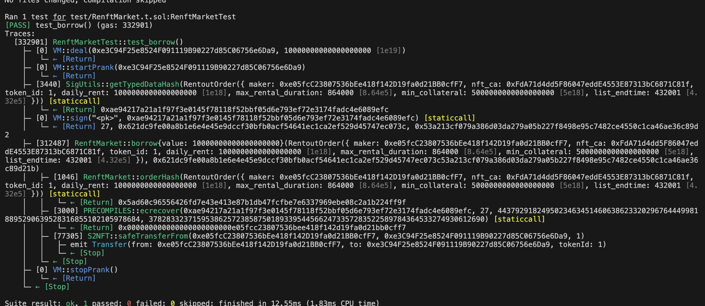
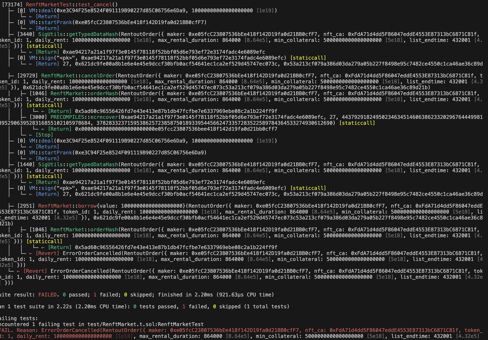

 

---

# EIP712 离线签名方式出租 NFT

## 1.准备阶段： NFT 所有者需要确定租赁条款，包括租赁时间、价格等关键信息，并将这些信息结构化。

struct RentoutOrder {
    address maker; // 出租方地址
    address nft_ca; // NFT合约地址
    uint256 token_id; // NFT tokenId
    uint256 daily_rent; // 每日租金
    uint256 max_rental_duration; // 最大租赁时长
    uint256 min_collateral; // 最小抵押
    uint256 list_endtime; // 挂单结束时间
  }

## 2.生成签名： 使用EIP712标准将租赁条款进行编码和签名。这一步骤不需要进行任何链上交互，因此大大降低了交易费用和时间。

## 3.发布租赁信息： 将签名后的租赁条款发布到市场或直接发送给租赁方，租赁方可以验证签名的有效性和条款的一致性。

## 4.执行租赁合同： 一旦租赁方接受条款并签名，合同即被激活。链上智能合约会验证双方的签名和条款，确保交易的执行严格按照协议进行。
### 使用EIP712离线签名出租NFT：

## 5.准备阶段： NFT所有者需要确定租赁条款，包括租赁时间、价格等关键信息，并将这些信息结构化。

## 6.生成签名： 使用EIP712标准将租赁条款进行编码和签名。这一步骤不需要进行任何链上交互，因此大大降低了交易费用和时间。

## 7.发布租赁信息： 将签名后的租赁条款发布到市场或直接发送给租赁方，租赁方可以验证签名的有效性和条款的一致性。

## 8.执行租赁合同： 一旦租赁方接受条款并签名，合同即被激活。链上智能合约会验证双方的签名和条款，确保交易的执行严格按照协议进行。

### 挑战要求：

### 完善已有项目： https://github.com/0xqige/openspace-nftrent-study/tree/0508A 实现 NFT 的出租和借入功能。
### 完整运行在 https://vercel.com/ 中
### 提交内容的：vercel.com上的可访问公共链接 和对应的仓库 github 链接。

---
## ‼️ 部署前端地址： 

https://openspace-nftrent-study-znpv.vercel.app/

---

## ‼️ 部署合约地址： 
| 名称                         |                    地址                    |
| :-------------------------- | :----------------------------------------: |
| S2NFT                       | [0x6fb74eb75e9ede685ac20d3442a444e3e24a27a7](https://sepolia.etherscan.io/address/0x6fb74eb75e9ede685ac20d3442a444e3e24a27a7#code) |
| NFTFactory                  | [0xc23dc102cabcbaf716c12c14b583f11e3f165919](https://sepolia.etherscan.io/address/0xc23dc102cabcbaf716c12c14b583f11e3f165919#code) |
| RenftMarket                 | [0x0a8e35002CD703ee80f6BF225271457e3F05260D](https://sepolia.etherscan.io/address/0x0a8e35002CD703ee80f6BF225271457e3F05260D#code) |

---
## ‼️ 测试合约脚本
[租聘市场合约测试脚本](contracts/test/RenftMarket.t.sol)

---
## ‼️ 部署合约脚本 
[租聘市场以及NFT工厂，NFT部署脚本](contracts/script/RenftMarket.s.sol)

---
## ‼️ 测试合约日志截图
 
